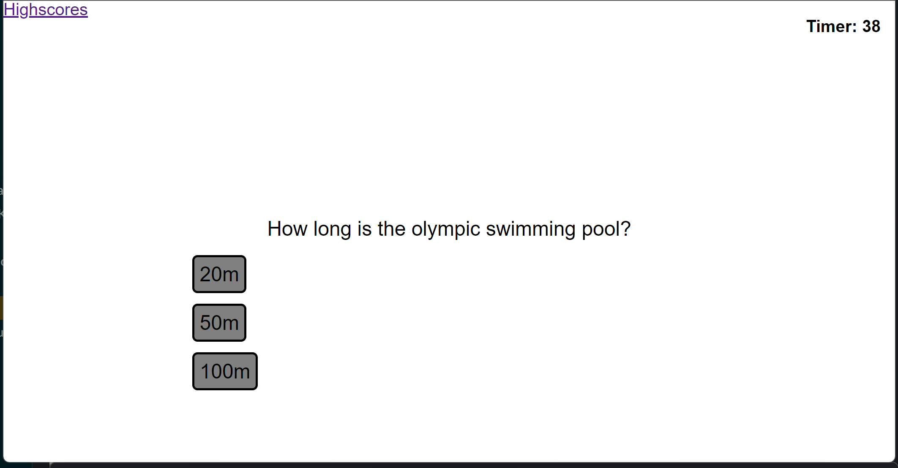

# codingquizap
UT Austin coding bootcamp challenge 4 - create a coding quiz app w advanced JavaScript

## Description

The following website is a timed trivia quiz. Users will have 60 seconds to complete once the Start Quiz button is clicked. Wrong answers will result in a 10 second penalty. At completion of the quiz, the final score will be the remaining time on the clock. A highscores page will be linked at the top to record scores that are submitted on the last page of the quiz.

## Installation

N/A

## Usage

Go to the following URL:
https://airen22.github.io/Bootcamp-Challenge4-codingquizapp/

The following image shows a screenshot of the website: 
The following image shows a screenshot of the highscores page: 

## Credits

Karen Peazzoni: https://github.com/kpeazzoni/UTA-bootcamp-timed-quiz

## License

Please refer to the LICENSE in the repo.